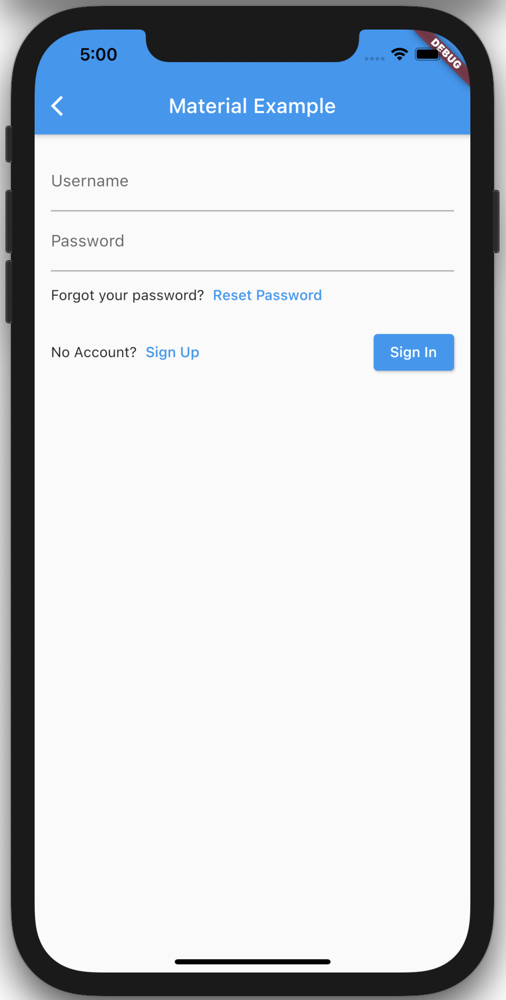
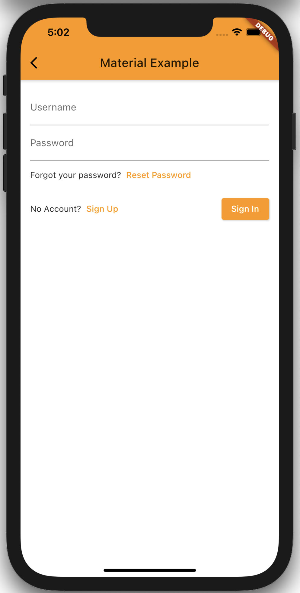

# Amplify UI

> Amplify components & primitives for Android, iOS, React Native & Web
> – https://quip-amazon.com/MdPqAAJZVS1a

## Local Development

1. [`nvm use`](https://github.com/nvm-sh/nvm)
1. `yarn install`
1. `yarn dev`
1. <http://localhost:3000/>

## For Vue

1. [`nvm use`](https://github.com/nvm-sh/nvm)
1. `yarn install`
1. `yarn dev:vue`
1. <http://localhost:3001/>

## For Angular

1. [`nvm use`](https://github.com/nvm-sh/nvm)
1. `yarn install`
1. `yarn build:angular`, or `yarn build:angular:watch` for live development
1. `yarn dev:angular`.
1. <http://localhost:4200/>

# amplify_authenticator

## Set up

- Install and set up [flutter](https://flutter.dev/docs/get-started/install) if you have not already done so

## Stories

### Basic Material Example

> A customer using Material design can import and authenticator and it will use the default material styles

See Example: [materialAuthenticatorExample.dart](./lib/stories/material/materialAuthenticatorExample.dart)

```dart
import 'package:amplify_authenticator/stories/viewUserInfo.dart';
import 'package:flutter/material.dart';
import 'package:amplify_authenticator/components/MaterialAuthenticator.dart';

class MaterialAuthenticatorExample extends StatelessWidget {
  @override
  Widget build(BuildContext context) {
    return Scaffold(
      appBar: AppBar(
        title: Text('Material Example'),
      ),
      body: Padding(
        padding: const EdgeInsets.all(16.0),
        child: MaterialAuthenticator(
          onSignInSuccess: () => Navigator.pushReplacement(
            context,
            MaterialPageRoute(
              builder: (context) => ViewUserInfo(),
            ),
          ),
        ),
      ),
    );
  }
}
```



### Custom Material Example

> A customer using Material design with a custom theme can import and authenticator and it will use the appropriate styles

See Example: [materialThemeExample.dart](./lib/stories/materialTheme/materialThemeExample.dart)

```dart
import 'package:amplify_authenticator/stories/viewUserInfo.dart';
import 'package:flutter/material.dart';
import 'package:amplify_authenticator/components/MaterialAuthenticator.dart';

class MaterialThemeExample extends StatelessWidget {
  @override
  Widget build(BuildContext context) {
    // Note: This would typically be passing into the MaterialApp() widget in a real world example
    ThemeData themeData = ThemeData.from(
      colorScheme: ColorScheme(
        brightness: Brightness.light,
        background: Colors.white,
        error: Colors.red,
        onBackground: Colors.blueGrey,
        onError: Colors.white,
        onPrimary: Colors.white,
        onSecondary: Colors.black,
        onSurface: Colors.black,
        primary: Colors.orange,
        primaryVariant: Colors.orange[700],
        secondary: Colors.yellow,
        secondaryVariant: Colors.yellow[700],
        surface: Colors.white,
      ),
    );
    return Theme(
      data: themeData,
      child: Scaffold(
        appBar: AppBar(
          title: Text('Material Example'),
        ),
        body: Padding(
          padding: const EdgeInsets.all(16.0),
          child: MaterialAuthenticator(
            onSignInSuccess: () => Navigator.pushReplacement(
              context,
              MaterialPageRoute(
                builder: (context) => ViewUserInfo(),
              ),
            ),
          ),
        ),
      ),
    );
  }
}

```


