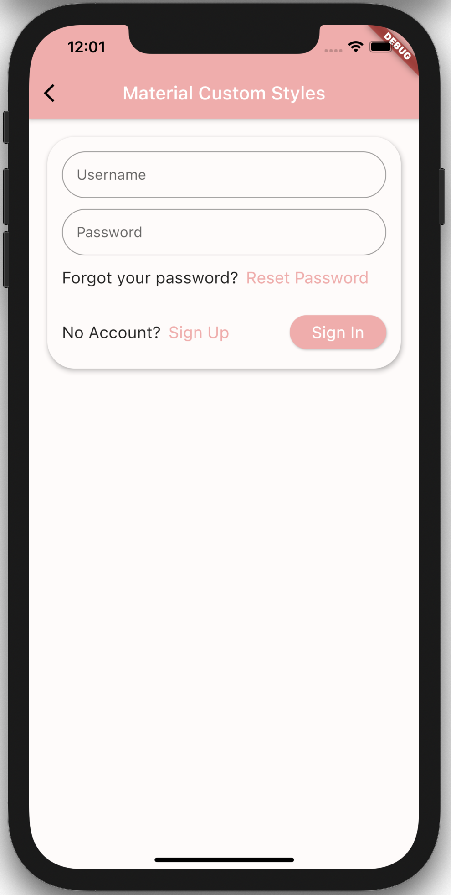
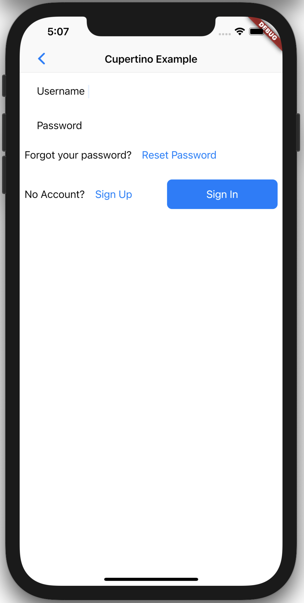

# Amplify UI

> Amplify components & primitives for Android, iOS, React Native & Web
> – https://quip-amazon.com/MdPqAAJZVS1a

## Local Development

1. [`nvm use`](https://github.com/nvm-sh/nvm)
1. `yarn install`
1. `yarn dev`
1. <http://localhost:3000/>

## For Vue

1. [`nvm use`](https://github.com/nvm-sh/nvm)
1. `yarn install`
1. `yarn dev:vue`
1. <http://localhost:3001/>

## For Angular

1. [`nvm use`](https://github.com/nvm-sh/nvm)
1. `yarn install`
1. `yarn build:angular`, or `yarn build:angular:watch` for live development
1. `yarn dev:angular`.
1. <http://localhost:4200/>

# amplify_authenticator

Flutter Amplify Authenticator UI component

## Set up

- Install and set up [flutter](https://flutter.dev/docs/get-started/install) and complete platform setup for iOS or Android if you have not already done so.
- [Set up your IDE](https://flutter.dev/docs/get-started/editor) for flutter development if you have not already done so.
- Run the project on an iOS simulator or Android Emulator. See info under **Run the App** in the [flutter test drive docs](https://flutter.dev/docs/get-started/test-drive?tab=androidstudio) if you are not familair with how to do this.

## Project overview

The project was created as a standard flutter app (using `flutter create`). All the cource code is under `/lib`. `/lib/authenticator` contains the authenitcator code that would be included in a package that customers would import and consume. `/lib/stories` contains the the customer use cases for an Authenticator widget. Each directory represents one use case. `main.dart` configures amplify auth and displays a list of buttons that will open the different use cases.

I have copied the code from the stories into the readme to make it easy to view. Long term, it would probably make sense to look into something like [Dashbook](https://github.com/erickzanardo/dashbook), [storybook_flutter](https://github.com/ookami-kb/storybook_flutter), or the tooling that the flutter team uses in their own component docs which takes comments from the code and turns them into live code examples.

If this were to actually be published as a package, the code under `/lib/stories` would either be broken out into a spearate project, or moved under `/example`. They are included in the main project for ease of development.

## TODO

Other than continuing to support additonal customer use cases, below are some things that are not yet supported

- Forgot password flow: Sign up, confirm account, and sign in all work as expected. Forgot password
- Error handling: Gracefully handle error on signin/signup
- localization
- Material & Cupertino code duplication: The logic for authentication should be abstracted out and shared.
- Animations: The form doesn't have any animations. Since the form is essentialy just a list of items that get removed/added, [AnimatedList](https://api.flutter.dev/flutter/widgets/AnimatedList-class.html) could probably be used. There could be some default animations, with the ability for users to provide their own.
- Cupertino design: This is not one of the customer use cases, but it would probably be something flutter devs would want. [Cupertino](https://flutter.dev/docs/development/ui/widgets/cupertino) widgets match the design of iOS.

## Theming Approach

Flutter provides two libraries of widgets out of the box - [Material](https://flutter.dev/docs/development/ui/widgets/material) and [Cupertino](https://flutter.dev/docs/development/ui/widgets/cupertino). These widget libraries are built on top of a "widgets layer", which is illustrated nicely in [this flutter architecture diagram](https://flutter.dev/docs/resources/architectural-overview#architectural-layers) (can seen below as well).


Both of these widget libraries work on all platforms that flutter supports, and with some exceptions (example: [Switch.adaptive()](https://api.flutter.dev/flutter/material/Switch/Switch.adaptive.html)), they do not adapt to the platform. This means that they will look & function identically on all platforms. Flutter also easily allows developers to build their app according to their own custom design systems ("Expressive and Flexible UI" is one of the core priciples of flutter). Engineers consuming an Amplify Authenticator widget will expect that out of the box both Material and Cupertino are supported, and that the out of the box widgets can be easily extended / customized to their own design system.

When it comes to custom design systems, there are two general approaches that can be taken. The first approach is to start with one of the two widget catelogs (usually material) and extend it to for the design system being used (see the notes on the material [ThemeData class](https://api.flutter.dev/flutter/material/ThemeData-class.html)). The second approach would be to build an entirely new library of widgets on top of the "widgets layer", similar to the Material or Cupertino libraries. The first approach is generally to approach that is taken because it is **far** less work and still allows developes to acheive their custom design system.

For the custom theme use case, it makes sense to focus on supporting the first approach. This would involve build the Authenticator component on top of the material widgets and ensuring it properly inherits the app's ThemeData, while still ensuring that the Authenticator component works in a non material app. Below are three reasons why this approach should be followed:

1. Building on top of material and using material's ThemeData to style the Authenticator widget will allow the Authenticator to inherit the apps Material theme. This means that customers that are already building their custom design system on top of material with the use of ThemeData will get an Authenticator widget that matches their design system for free.
2. Customers that are building an entirely new widget library on top of the "widgets layer" are likley doing so to acheive a highly customized design that they have 100% control over. An out of the box authenticator component will almost certaintly not meet their needs if their design system is highly customized and requires 100% control. They would likely choose to build their authentication UI from scratch in order to meet their highly customized design.
3. Customers that are building on top of the widgets layer, will still be able to consume an Authenticator widget that is built on top of material and consume it in their non-material app. They will be able to wrap the widget in a `Theme()` widget an provide a custom theme. These customers will just not get their custom theme applied for free. They will have to do some work to use a material ThemeData that closely matches their design system.

## Stories

Each of the code snippets below depnds on amplify being configured in the clients application. In this project, that is done in `main.dart`. The configuration could in theory be done inside the Authenticator component, but it seems more straight forward to just require the consumers to configure Amplify outside of the component.

### Material Design basic use case

> A customer using Material design can import and authenticator and it will use the default material styles

See Example: [materialAuthenticatorExample.dart](./lib/stories/material/materialAuthenticatorExample.dart)

```dart
import 'package:amplify_authenticator/stories/viewUserInfo.dart';
import 'package:flutter/material.dart';
import 'package:amplify_authenticator/components/MaterialAuthenticator.dart';

class MaterialAuthenticatorExample extends StatelessWidget {
  @override
  Widget build(BuildContext context) {
    return Scaffold(
      appBar: AppBar(
        title: Text('Material Example'),
      ),
      body: Padding(
        padding: const EdgeInsets.all(16.0),
        child: MaterialAuthenticator(
          onSignInSuccess: () => Navigator.pushReplacement(
            context,
            MaterialPageRoute(
              builder: (context) => ViewUserInfo(),
            ),
          ),
        ),
      ),
    );
  }
}
```


### Material Design w/ custom material theme

> A customer using Material design with a custom material theme can import and authenticator and it will use the appropriate styles

See Example: [materialThemeExample.dart](./lib/stories/materialTheme/materialThemeExample.dart)

```dart
import 'package:amplify_authenticator/stories/viewUserInfo.dart';
import 'package:flutter/material.dart';
import 'package:amplify_authenticator/components/MaterialAuthenticator.dart';

class MaterialThemeExample extends StatelessWidget {
  @override
  Widget build(BuildContext context) {
    // Note: This would typically be passed into the MaterialApp() widget in a real world example
    ThemeData themeData = ThemeData.from(
      colorScheme: ColorScheme(
        brightness: Brightness.light,
        background: Colors.white,
        error: Colors.red,
        onBackground: Colors.blueGrey,
        onError: Colors.white,
        onPrimary: Colors.white,
        onSecondary: Colors.black,
        onSurface: Colors.black,
        primary: Colors.orange,
        primaryVariant: Colors.orange[700],
        secondary: Colors.yellow,
        secondaryVariant: Colors.yellow[700],
        surface: Colors.white,
      ),
    );
    return Theme(
      data: themeData,
      child: Scaffold(
        appBar: AppBar(
          title: Text('Material Example'),
        ),
        body: Padding(
          padding: const EdgeInsets.all(16.0),
          child: MaterialAuthenticator(
            onSignInSuccess: () => Navigator.pushReplacement(
              context,
              MaterialPageRoute(
                builder: (context) => ViewUserInfo(),
              ),
            ),
          ),
        ),
      ),
    );
  }
}

```


### Material Design w/ custom material theme

> A customer using custom design system (built on top of material) can import and authenticator and it will use the appropriate styles

```dart
import 'package:amplify_authenticator/stories/viewUserInfo.dart';
import 'package:flutter/material.dart';
import 'package:amplify_authenticator/authenticator/components/materialAuthenticator.dart';

const _primary = const Color(0xFFFAAAAA);
const _secondary = const Color(0xFF5C83C9);
const _error = const Color(0xFFC5032B);
const _surface = const Color(0xFFFFFBFA);

class MaterialCustomeStylesExample extends StatelessWidget {
  @override
  Widget build(BuildContext context) {
    // This is an example of how the authneticator widget will inherit and use the Material ThemeData
    // Note: these themes could (and probably should) be applied app wide (provided to MaterialApp()),
    // but can also be applied locally like in this example
    ThemeData themeData = ThemeData.from(
      colorScheme: ColorScheme(
        brightness: Brightness.light,
        background: _surface,
        error: _error,
        onBackground: Colors.blueGrey,
        onError: Colors.white,
        onPrimary: Colors.white,
        onSecondary: Colors.white,
        onSurface: Colors.black,
        primary: _primary,
        primaryVariant: _primary,
        secondary: _secondary,
        secondaryVariant: _secondary,
        surface: _surface,
      ),
    ).copyWith(
      textTheme: Theme.of(context).textTheme.copyWith(
            bodyText2: Theme.of(context).textTheme.bodyText2.copyWith(
                  fontSize: 18,
                ),
          ),
      inputDecorationTheme: InputDecorationTheme(
        contentPadding: EdgeInsets.all(16),
        border: OutlineInputBorder(
          borderRadius: const BorderRadius.all(
            Radius.circular(30),
          ),
          gapPadding: 0,
        ),
      ),
      textButtonTheme: TextButtonThemeData(
        style: TextButton.styleFrom(
          textStyle: TextStyle(
            fontSize: 18,
          ),
        ),
      ),
      elevatedButtonTheme: ElevatedButtonThemeData(
        style: ElevatedButton.styleFrom(
          shape: RoundedRectangleBorder(
            borderRadius: BorderRadius.circular(30),
          ),
          padding: EdgeInsets.symmetric(
            horizontal: 24,
            vertical: 8,
          ),
          textStyle: TextStyle(
            fontSize: 18,
          ),
        ),
      ),
    );
    return Theme(
      data: themeData,
      child: Scaffold(
        appBar: AppBar(
          title: Text(
            'Material Custom Styles',
            style: TextStyle(color: Colors.white),
          ),
        ),
        body: Padding(
          padding: const EdgeInsets.all(16.0),
          child: Column(
            children: [
              Card(
                shape: RoundedRectangleBorder(
                  borderRadius: BorderRadius.circular(30),
                ),
                elevation: 4,
                child: Padding(
                  padding: const EdgeInsets.all(16),
                  child: MaterialAuthenticator(
                    onSignInSuccess: () => Navigator.pushReplacement(
                      context,
                      MaterialPageRoute(
                        builder: (context) => ViewUserInfo(),
                      ),
                    ),
                  ),
                ),
              ),
            ],
          ),
        ),
      ),
    );
  }
}

```



### Use outside of MaterialApp or CupertinoApp

> A customer that is not using the Material or Cupertino design systems as a base can still consume the Authenticor widget.

> Material Authenticator can be consumed inside a non material app

TODO

### Cupertino Design basic use case

> A customer using Cupertino design can import and authenticator and it will use the default cupertino styles

```dart
import 'package:amplify_authenticator/authenticator/components/cupertinoAuthenticator.dart';
import 'package:amplify_authenticator/stories/viewUserInfo.dart';
import 'package:flutter/cupertino.dart';
import 'package:flutter/material.dart';

class CupertinoAuthenticatorExample extends StatelessWidget {
  @override
  Widget build(BuildContext context) {
    return CupertinoApp(
      home: CupertinoPageScaffold(
        navigationBar: CupertinoNavigationBar(
          leading: CupertinoNavigationBarBackButton(
            onPressed: () => Navigator.of(context).pop(),
          ),
          middle: Text('Cupertino Example'),
        ),
        child: SafeArea(
          child: Padding(
            padding: const EdgeInsets.all(8.0),
            child: CupertinoAuthenticator(
              onSignInSuccess: () => Navigator.pushReplacement(
                context,
                CupertinoPageRoute(
                  builder: (context) => ViewUserInfo(),
                ),
              ),
            ),
          ),
        ),
      ),
    );
  }
}

```

TODO: The Cupertino style widgets by default are really plain. It might make sense to have a real word example with some styling applied.


