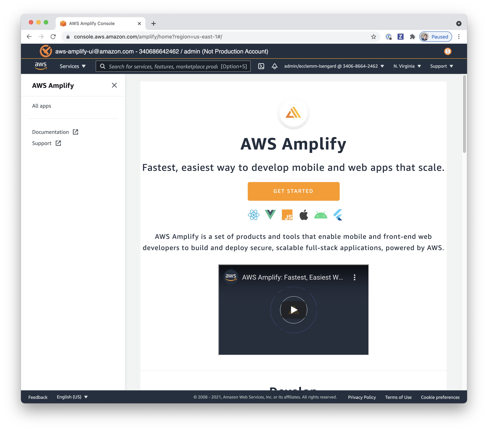
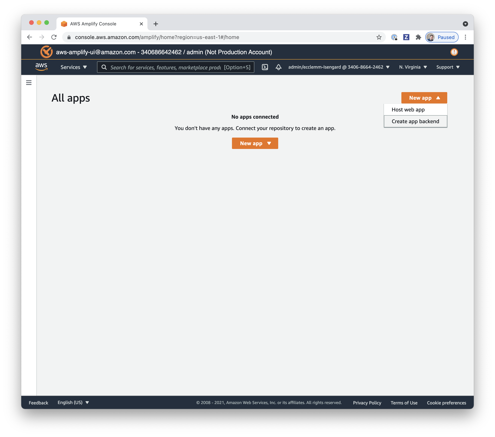
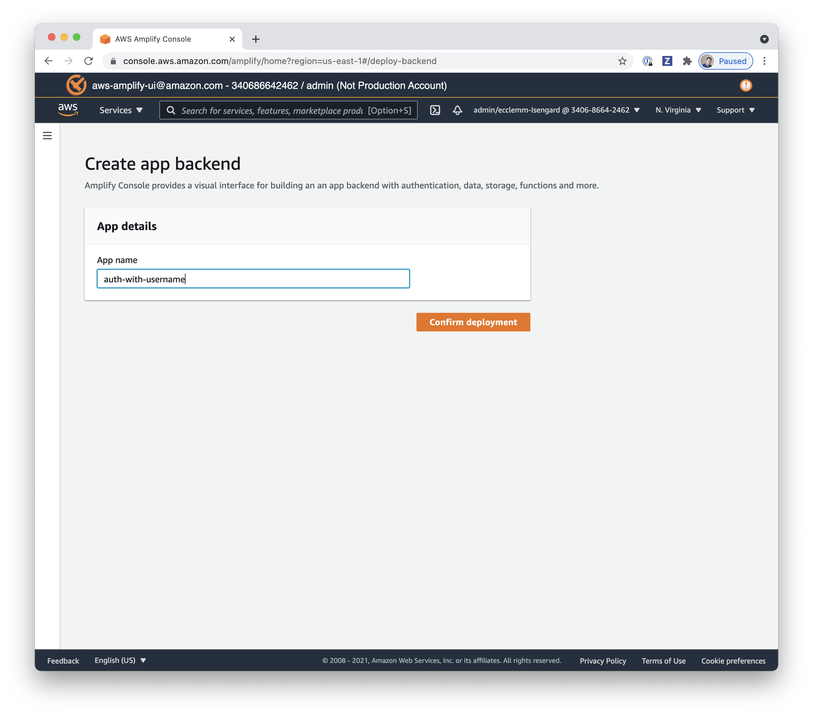
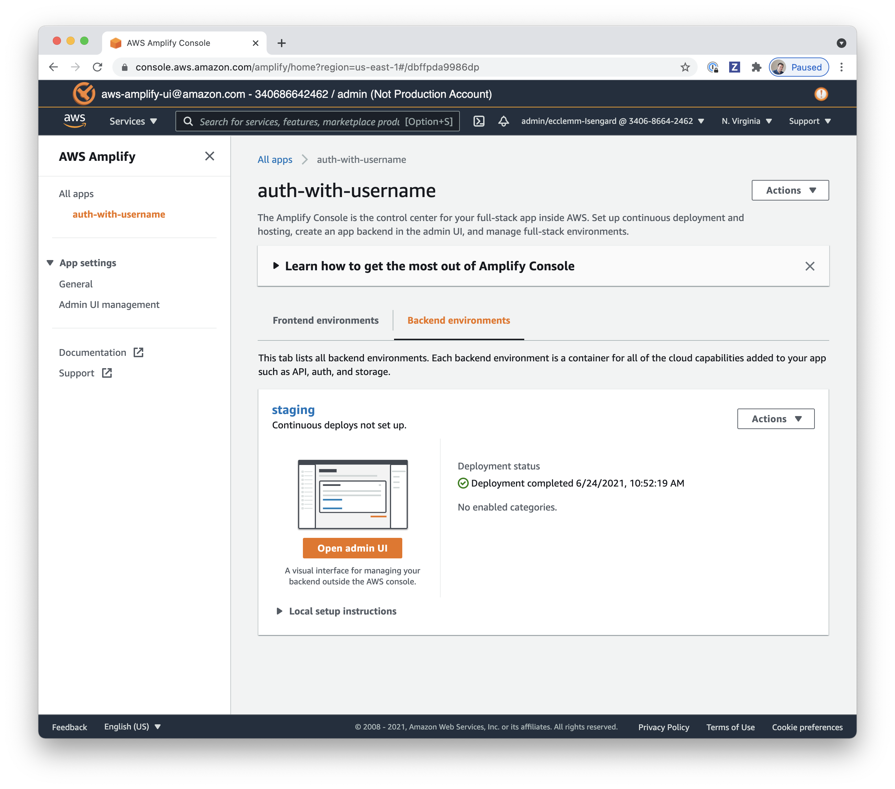
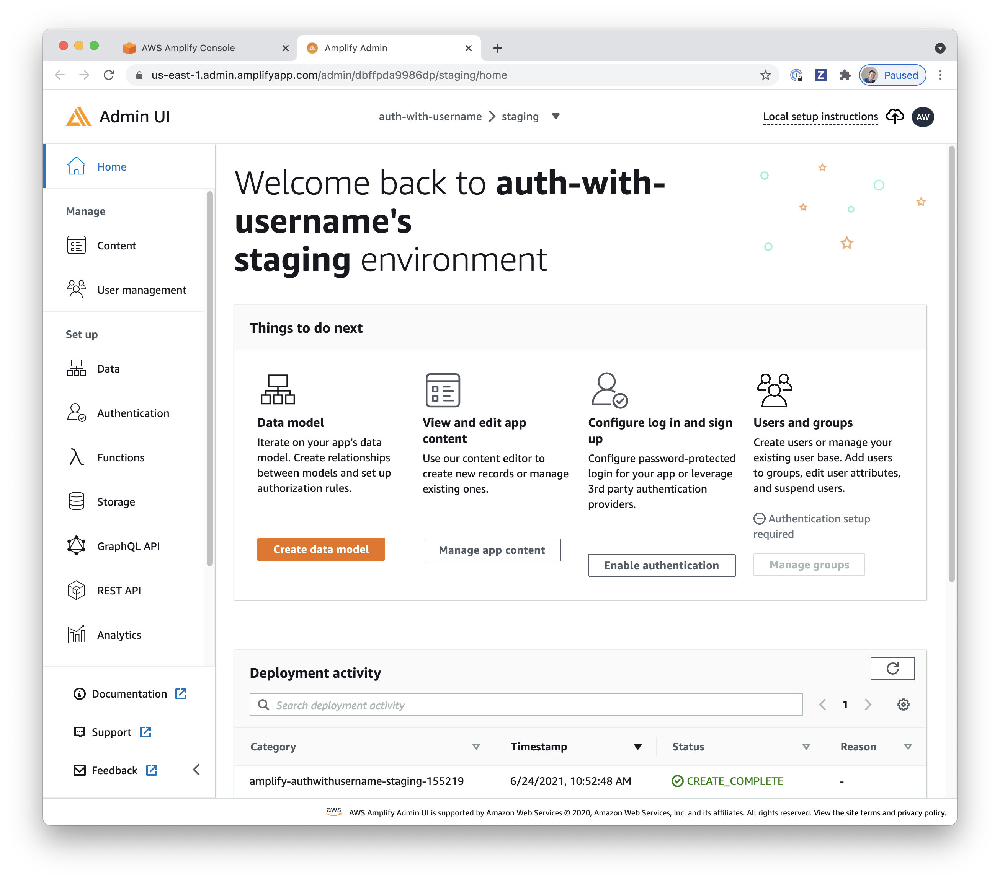
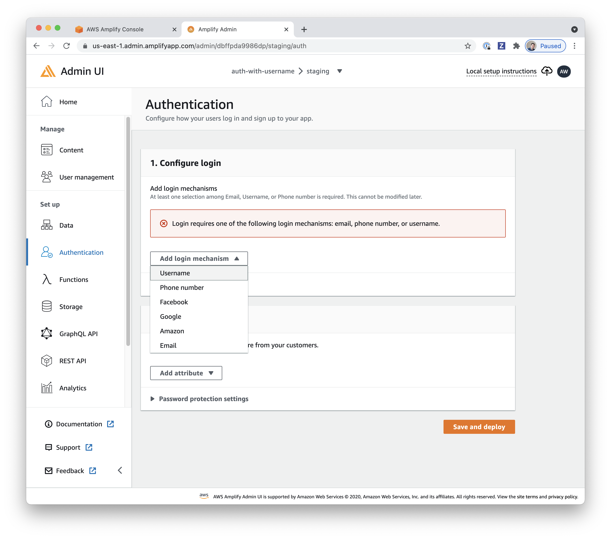
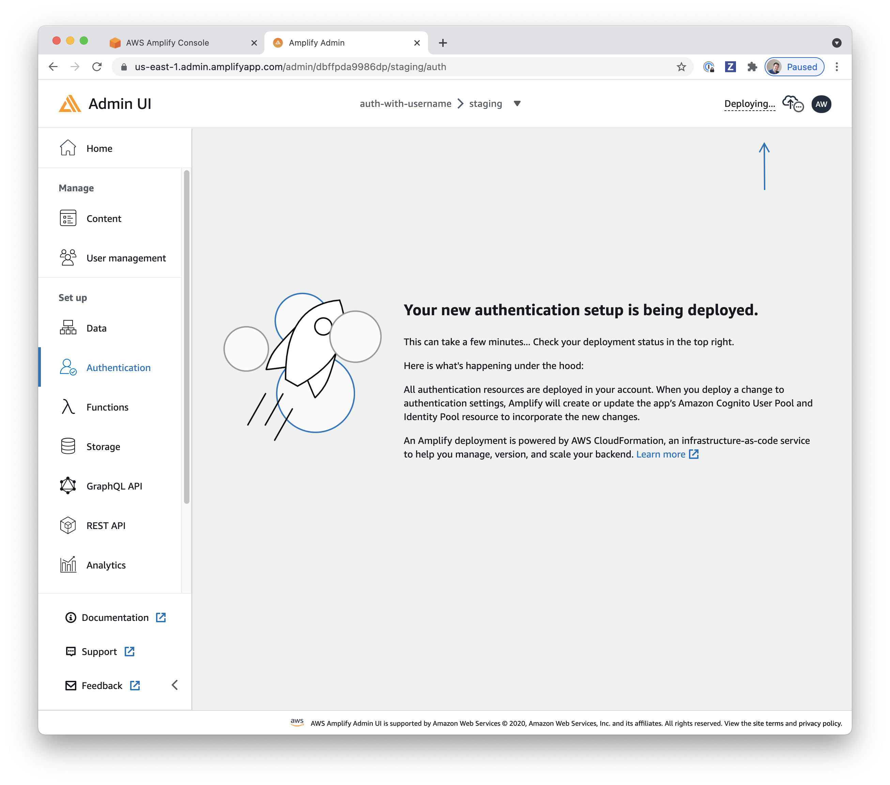
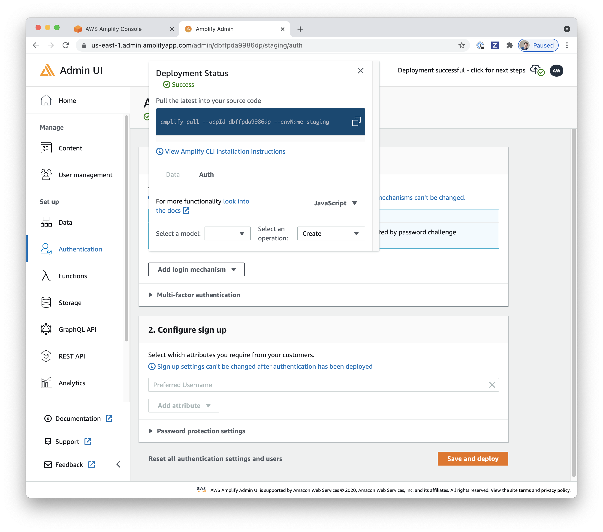

# Backend Environments

This folder contains a list of pre-built Amplify backends for use with manual & automated testing.

## Re-using a Backend Environment

For manual & E2E testing, you need a live backend to work against and your app needs an `aws-exports.js`.

Within [/environments](/environments), there are pre-built backend environments that you can re-use by either:

1. Manually following the steps in the `README.md` ([example](auth-with-username/README.md))
1. Or running `amplify pull` within that folder.

This will create a `src/aws-exports.js` for use in your testing.

_Note: If you are taken to a sign in screen when pulling an environment with `amplify pull`, you can workaround this by first visiting the Amplify Admin UI for that environment ([example](https://us-east-1.admin.amplifyapp.com/admin/dbffpda9986dp/staging/home))and then attempting to pull it again._

## Creating a Backend Environment

When an existing backend doesn't match your needs (or requires changes), you can create a new backend via the [Amplify Admin](https://console.aws.amazon.com/amplify/home?region=us-east-1#/) or the [Amplify CLI](https://docs.amplify.aws/cli).

### With Admin UI

1. Open https://console.aws.amazon.com/amplify/home?region=us-east-1#/ and click "All apps":

   

1. Under "New app", click "Create app backend":

   

1. Enter a descriptive name for this environment (e.g. `auth-with-username`) and click "Confirm deployment":

   

1. Click "Open Admin UI":

   

1. Enable your backend categories.

   For [auth-with-username](auth-with-username), we clicked "Enable authentication":

   

1. Configure your category or categories:

   For [auth-with-username](auth-with-username), we added the `Username` login mechanism:

   

1. Click "Save and deploy" then wait a few minutes:

   

1. Finally, you'll have "Local setup instructions" in the top-right:

   ```shell
   amplify pull --appId ... --envName staging
   ```

   

1. Next, in your terminal create a folder for this environment:

   ```shell
   cd environments

   # Change change this next line to match your app name
   mkdir auth-with-username
   cd $_
   ```

1. Run the `amplify pull ...` command from Admin UI:

   ```shell
   amplify pull --appId ... --envName staging --yes
   ```

   (Passing `--yes` will skip `amplify init` props and select defaults automatically)

🎉 You now have a local `amplify` & `src/aws-exports.js` environment!

## Commiting a Backend Environment

After creating & `amplify pull`ing a backend environment down for local development, it can be useful to commit that for future use in testing or for collaboration.

1. First, create a `README.md` that describes what makes this backend unique ([example](auth-with-username/README.md))

1. Then, use git to stage, commit, & push your changes as you normally would:

   ```shell
   # Within environments/my-custom-environment:
   git add .

   # This will add `amplify`, `src`, and `.gitignore` generated by `amplify pull`
   git commit -m "Add my-custom-environment backend"
   ```
