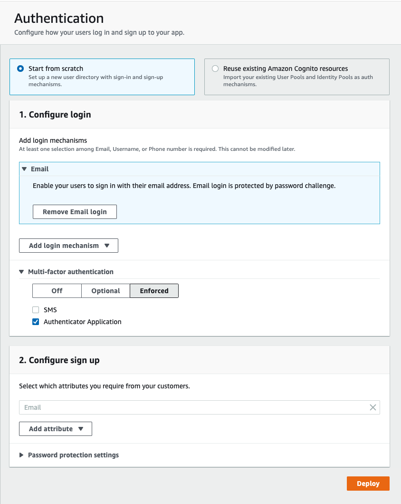

# Auth with TOTP MFA

This backend is configured with Amplify Admin UI (whereas [`auth-with-totp-mfa`](../auth-with-totp-mfa) is an manually configured Cognito User Pool):

- Authentication

  - `Email` login mechanism

    

  - Multi-factor Authentication

    - `Enforced`

    - [ ] SMS
    - [x] Authenticator Application

## Using this Backend

External contributors can re-create this backend by running:

```shell
amplify pull
```

Internal (Amplify UI team) contributors can use this backend directly by running:

```shell
amplify pull --appId d1ldfls4rvd66e --envName staging --yes
```
