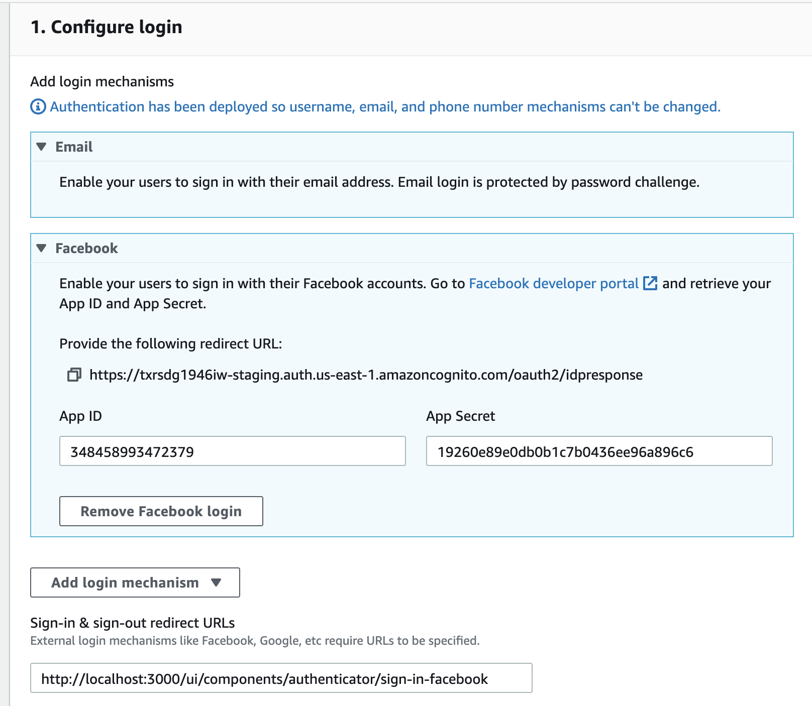

# Auth with Facebook

This backend is configured with Amplify Admin UI:

- Authentication

  - `Facebook` login mechanism

    

  - `Email` sign up attribute

    (This was defaulted by Admin UI, not explicitly set)

    

## Using this Backend

External contributors can re-create this backend by running:

```shell
amplify pull
```

Internal (Amplify UI team) contributors can use this backend directly by running:

```shell
amplify pull --appId d3udf6rqwo8obv --envName staging
```
