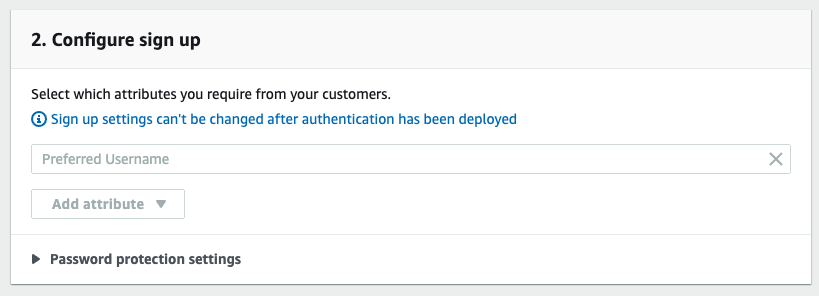

# Auth with Username

This backend is configured with Amplify Admin UI:

- Authentication

  - `Username` login mechanism

    

  - `Preferred Username` attribute

    (This was defaulted by Admin UI, not explicitly set)

    

## Using this Backend

External contributors can re-create this backend by running:

```shell
amplify pull
```

Internal (Amplify UI team) contributors can use this backend directly by running:

```shell
amplify pull --appId dbffpda9986dp --envName staging --yes
```
