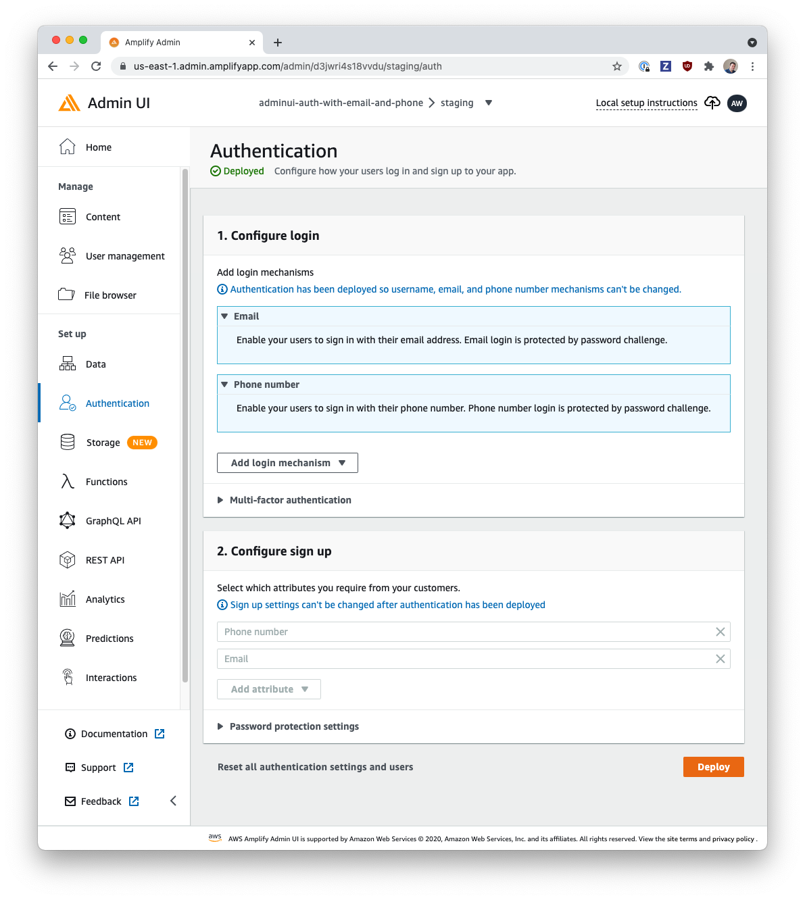

# Auth with Email & Phone Number

This backend is configured with Amplify Admin UI:

- Authentication

  - `Email` login mechanism & custom attribute
  - `Phone number` login mechanism & custom attribute

    

## Using this Backend

External contributors can re-create this backend by running:

```shell
amplify pull
```

Internal (Amplify UI team) contributors can use this backend directly by running:

```shell
amplify pull --appId d3jwri4s18vvdu --envName staging --yes
```
