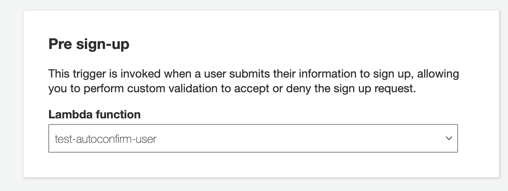

# Auth with Email Lambda Signup Trigger

This backend is configured with Amplify Admin UI & cloned with Amplify CLI v6.3.1:

- Authentication

  - `Email` login mechanism

- Lambda Function

  - Custom Lambda function that autoconfirms the user, email, and phone number.

  ```js
  exports.handler = async (event, context, callback) => {
    // Confirm the user
    event.response.autoConfirmUser = true;

    // Set the email as verified if it is in the request
    if (event.request.userAttributes.hasOwnProperty('email')) {
      event.response.autoVerifyEmail = true;
    }

    // Set the phone number as verified if it is in the request
    if (event.request.userAttributes.hasOwnProperty('phone_number')) {
      event.response.autoVerifyPhone = true;
    }

    callback(null, event);
  };
  ```

- Pre sign-up trigger in Cognito

  - Runs lambda before sign up completes.

    

## Using this Backend

External contributors can re-create this backend by running:

```shell
amplify pull
```

Internal (Amplify UI team) contributors can use this backend directly by running:

```shell
amplify pull --appId d343e09nscxidh --envName staging
```
