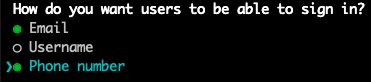

# DEPRECATED - Auth with Multiple Sign In Aliases

> **This auth configuration has been deprecated and is no longer supported by Amplify**
> See: https://docs.amplify.aws/cli/migration/cli-auth-signup-changes/

---

This environment allows users to sign in using a username, email, or phone number. Allowing users to sign in using multiple aliases requires configuring your `auth` backend using the Amplify CLI.

## Configuring the Backend

To configure your application's `auth` backend to allow multiple sign in aliases, follow these steps:

1. In your application's root directory, add authentication using the Amplify CLI:

   ```shell
   amplify add auth
   ```

1. When prompted `Do you want to use the default authentication and security configuration?`, select `Manual configuration`
1. When prompted `How do you want users to be able to sign in?`, select the aliases you would like users to be able to use to sign in to your application:

   > 

   _Note: a username is still required when a user creates an account and is treated as a sign in alias regardless of if it was selected as an option._

1. You may choose the remaining configuration options however you see fit

## Using this Backend

Follow the general instructions for internal and external contributors for [using an existing backend environment](../README.md#Using-an-Existing-Backend-Environment).
