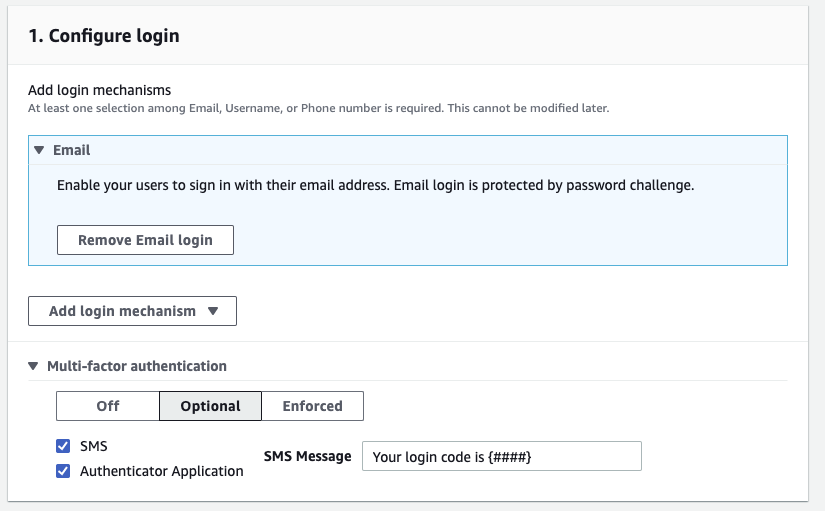
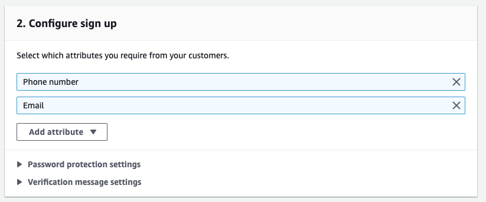

# Auth with Optional TOTP and SMS MFA

This backend is configured with Amplify Studio:

- Authentication

  - `Email` login mechanism

    

  - `Email` and `Phone number` sign up attribute

    

## Using this Backend

External contributors can re-create this backend by running:

```shell
amplify init
```
