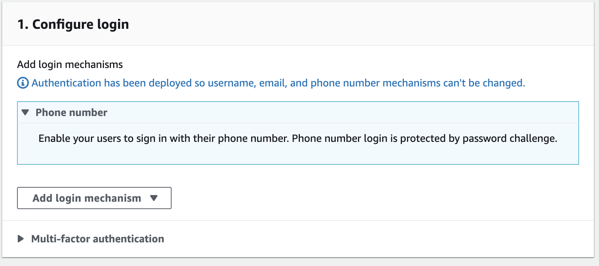
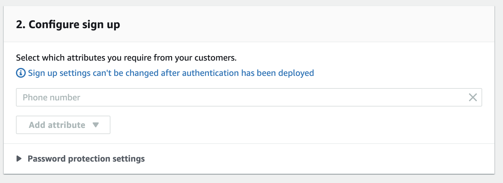

# Auth with Phone Number

This backend is configured with Amplify Admin UI:

- Authentication

  - `Phone Number` login mechanism

    

  - `Preferred phone number` attribute

    (This was defaulted by Admin UI, not explicitly set)

    

## Using this Backend

External contributors can re-create this backend by running:

```shell
amplify init
```
