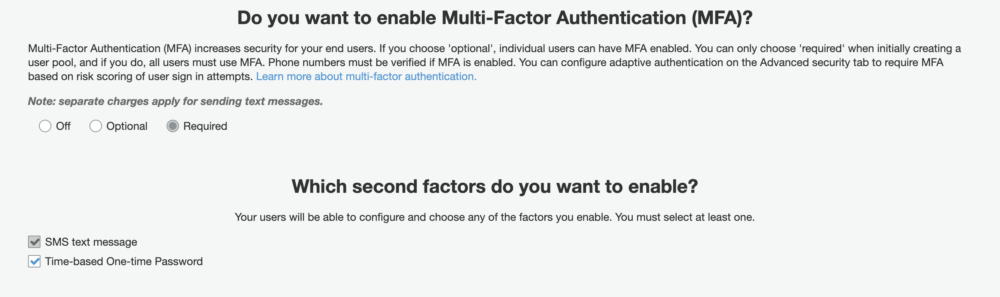

# Auth with TOTP and SMS MFA

This backend is configured with Amplify Admin UI:

- Authentication

  - `Cognito` MFA setup

    

  - Requires `email` as the "username" when signing up and logging in

## Using this Backend

External contributors can re-create this backend by running:

```shell
amplify init
```
