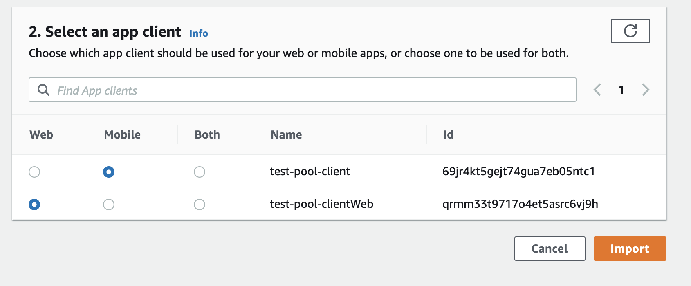

## Overview

This environment was created differently than others due to a bug in the Amplify Admin UI / CLI. The bug prevents you from being able to solely enable TOTP MFA without SMS MFA also being enabled. As a result, it was necessary to manually create a Cognito User Pool and then link that user pool to an Amplify backend environment. The steps to reproduce this are as follows --

## Steps

1. Go to the AWS Cognito console and click on `Manage User Pools`
1. Click on `Create a user pool` in the top right
1. Enter any name you want, and then click `Review defaults`


1. Click on `Enable MFA...` to edit the MFA settings
1. In the first section entitled `Do you want to enable Multi-Factor Authentication (MFA)?`, choose either `Required` or `Optional`. You can set this up either way you'd like.
1. In the section entitled `Which second factors do you want to enable?`, choose ONLY `Time-based One-time Password`


1. Fill out the rest of the settings on this page however you'd like, but at the bottom of this page, there will be a section entitled `You must provide a role to allow Amazon Cognito to send SMS messages`. In this section, there is an option for you to create an SNS role to allow Cognito to send SMS messages on your behalf. DO NOT CLICK THE `Create role` BUTTON!


1. Hit the `Save` button.
1. There is one other section that we need to manually fill out. Click on the `App clients` section in the left nav bar.


1. We will be creating two clients here. Click on the `Add an app client` button. You can choose any name you like. For convention purposes, you can give it the same name as your userpool with `-client` at the end.
1. UNCHECK the `Generate client secret` box
1. Switch the `Security configuration` to `Legacy`
1. The rest of the settings here can be left as the defaults
1. Click `Create app client`


1. Click `Add an app client` again. Time for the second app client.
1. Choose all the same settings as the first client, but change the name of this one to have a suffix of `-clientWeb` instead of just `-client`.
1. Click `Create app client`


1. Click on `Review` on the left nav
1. Click on `Create pool`

1. Next, we will navigate to the `AWS Amplify Console`
1. In the same region as you the User Pool you just created, click on `New app -> Create app backend`


1. Enter anything for your app name. Same as your user pool if you want. Then create the backend.
1. Once the backend is done being set up, click the `Open admin UI` button
1. Click on `Enable authentication` in the Admin UI
1. Click the radio button for `Reuse existing Amazon Cognito resources`


1. Select the Cognito user pool that you just created
1. In the second section, select the radio button for `Web` for the web client that you made, and `Mobile` for the non-web client.



1. Click on `Import`
1. When the user pool is done being imported, click on the `Deployment successful - click for next steps` in the top right


1. Copy the command and paste it in your terminal when you are ready to pull down the app. NOTE - do not pass the `--yes` flag to this command like other environments in this package will tell you to do. There is a bug in the CLI here that can cause failures if you do so. Instead, manually configure each step of the process, and when you get to the step that asks `Do you plan on modifying this backend?`, enter `Y`.


External contributors can re-create this backend by running:

```shell
amplify init
```
