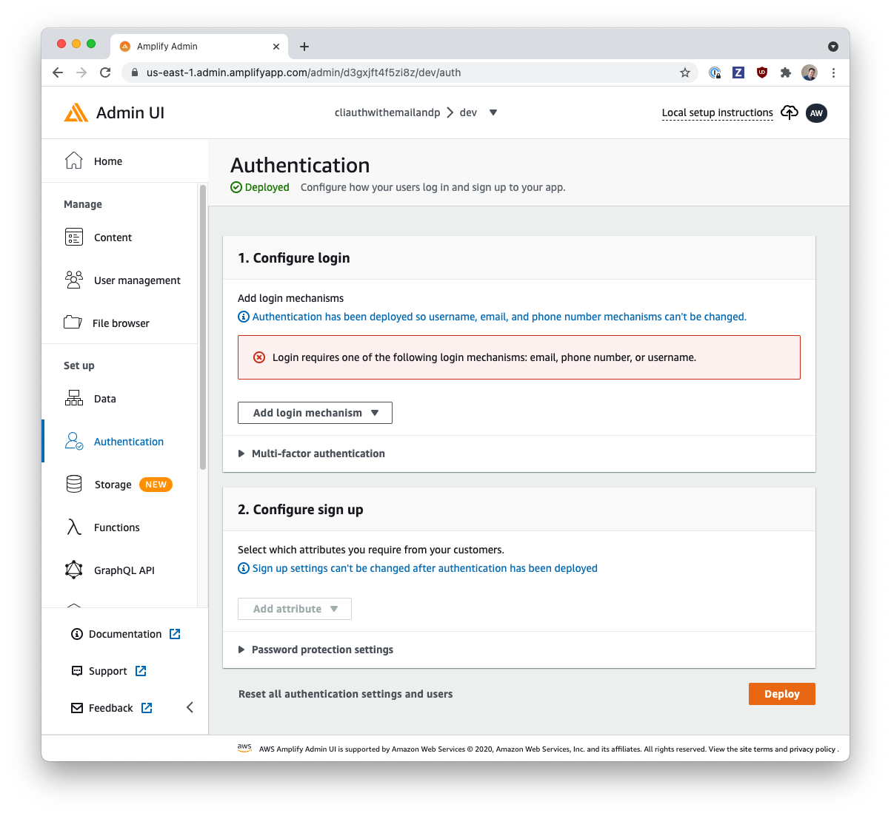

# Auth with Email & Phone Number

This backend is configured with Amplify CLI:

```shell
amplify init -y
```

- Authentication

  - `Email` or `Phone Number` login mechanism

    ```shell
    ❯ amplify add auth
    Using service: Cognito, provided by: awscloudformation

    The current configured provider is Amazon Cognito.

    Do you want to use the default authentication and security configuration? Default configuration
    Warning: you will not be able to edit these selections.
    How do you want users to be able to sign in? Email or Phone Number
    Do you want to configure advanced settings? No, I am done.
    ```

## Using this Backend

External contributors can re-create this backend by running:

```shell
amplify pull
```

Internal (Amplify UI team) contributors can use this backend directly by running:

```shell
amplify pull --appId d3gxjft4f5zi8z --envName dev --yes
```

> 
