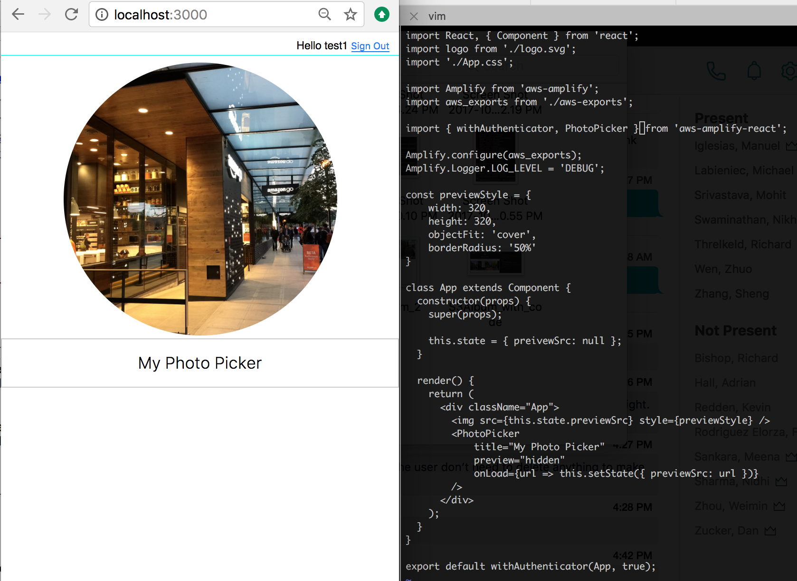

# AWS Amplify Package - aws-amplify-react

AWS Amplify is a JavaScript library for frontend and mobile developers building cloud-enabled applications. The library is a declarative interface across different categories of operations in order to make common tasks easier to add into your application. The default implementation works with Amazon Web Services (AWS) resources but is designed to be open and pluggable for usage with other cloud services that wish to provide an implementation or custom backends.

`aws-amplify-react` is one of the AWS Amplify library packages, provide building blocks for React App development. Documentation is available [here](https://github.com/aws-amplify/amplify-js/blob/main/README.md)

## Installation

```
yarn add aws-amplify aws-amplify-react
```

---

# Authenticator

## Using withAuthenticator HOC

For React, the simplest way to add authentication flows into your app is to use the `withAuthenticator` Higher Order Component.

`withAuthenticator` automatically detects the authentication state and updates the UI. If the user is signed in, the underlying component (typically your app's main component) is displayed otherwise signin/signup controls are displayed.

> The default implementation uses the Amplify UI styling, for an example of what that looks like out of the box on web and mobile, see <a href="https://aws-amplify.github.io/media/ui_library" target="_blank">here</a>.

Just add these two lines to your `App.js`:

```javascript
import { withAuthenticator } from 'aws-amplify-react'; // or 'aws-amplify-react-native';
import Amplify from 'aws-amplify';
// Get the aws resources configuration parameters
import awsconfig from './aws-exports'; // if you are using Amplify CLI

Amplify.configure(awsconfig);

// ...

export default withAuthenticator(App);
```

Now, your app has complete flows for user sign-in and registration. Since you have wrapped your **App** with `withAuthenticator`, only signed in users can access your app. The routing for login pages and giving access to your **App** Component will be managed automatically.

`withAuthenticator` component renders your App component after a successful user signed in, and it prevents non-sign-in users to interact with your app. In this case, we need to display a _sign-out_ button to trigger the related process.

To display a sign-out button or customize other, set `includeGreetings = true` in the parameter object. It displays a _greetings section_ on top of your app, and a sign-out button is displayed in the authenticated state. Other customization options are also available as properties to the HOC:

```jsx
export default withAuthenticator(App, {
  // Render a sign out button once logged in
  includeGreetings: true,
  // Show only certain components
  authenticatorComponents: [MyComponents],
  // display federation/social provider buttons
  federated: { myFederatedConfig },
  // customize the UI/styling
  theme: { myCustomTheme },
});
```

## Using the Authenticator Component

The `withAuthenticator` HOC wraps an `Authenticator` component. Using `Authenticator` directly gives you more customization options for your UI.

```jsx
<Authenticator
  // Optionally hard-code an initial state
  authState="signIn"
  // Pass in an already authenticated CognitoUser or FederatedUser object
  authData={CognitoUser | 'username'}
  // Fired when Authentication State changes
  onStateChange={(authState) => console.log(authState)}
  // An object referencing federation and/or social providers
  // The federation here means federation with the Cognito Identity Pool Service
  // *** Only supported on React/Web (Not React Native) ***
  // For React Native use the API Auth.federatedSignIn()
  federated={myFederatedConfig}
  // A theme object to override the UI / styling
  theme={myCustomTheme}
  // Hide specific components within the Authenticator
  // *** Only supported on React/Web (Not React Native)  ***
  hide={[
    Greetings,
    SignIn,
    ConfirmSignIn,
    RequireNewPassword,
    SignUp,
    ConfirmSignUp,
    VerifyContact,
    ForgotPassword,
    TOTPSetup,
    Loading,
  ]}
  // or hide all the default components
  hideDefault={true}
  // Pass in an aws-exports configuration
  amplifyConfig={myAWSExports}
  // Pass in a message map for error strings
  errorMessage={myMessageMap}
>
  // Default components can be customized/passed in as child components. //
  Define them here if you used hideDefault={true}
  <Greetings />
  <SignIn federated={myFederatedConfig} />
  <ConfirmSignIn />
  <RequireNewPassword />
  <SignUp />
  <ConfirmSignUp />
  <VerifyContact />
  <ForgotPassword />
  <TOTPSetup />
  <Loading />
</Authenticator>
```

## Customize your own components

You can provide custom components to the `Authenticator` as child components in React and React Native.

```jsx
import { Authenticator, SignIn } from 'aws-amplify-react';

// The override prop tells the Authenticator that the SignUp component is not hidden but overridden
<Authenticator hideDefault={true}>
  <SignIn />
  <MyCustomSignUp override={'SignUp'} />
</Authenticator>;

class MyCustomSignUp extends Component {
  constructor() {
    super();
    this.gotoSignIn = this.gotoSignIn.bind(this);
  }

  gotoSignIn() {
    // to switch the authState to 'signIn'
    this.props.onStateChange('signIn', {});
  }

  render() {
    return (
      <div>
        {/* only render this component when the authState is 'signUp' */}
        {this.props.authState === 'signUp' && (
          <div>
            My Custom SignUp Component
            <button onClick={this.gotoSignIn}>Goto SignIn</button>
          </div>
        )}
      </div>
    );
  }
}
```

You can render the custom component (or not) based on the injected `authState` within your component as well as jump to other states within your component.

```jsx
if (props.onStateChange) props.onStateChange(state, data);
```

To customize the UI for Federated Identities sign-in, you can use `withFederated` component. The following code shows how you customize the login buttons and the layout for social sign-in.

> **_The withFederated and Federated components are not supported on React Native_**. Use the API Auth.federatedSignIn() on React Native.

```javascript
import { withFederated } from 'aws-amplify-react';

const Buttons = (props) => (
    <div>
        
        
        
    </div>
)

const Federated = withFederated(Buttons);

...

const federated = {
    google_client_id: '', // Enter your google_client_id here
    facebook_app_id: '', // Enter your facebook_app_id here
    amazon_client_id: '' // Enter your amazon_client_id here
};

<Federated federated={federated} onStateChange={this.handleAuthStateChange} />
```

There is also `withGoogle`, `withFacebook`, `withAmazon` components, in case you need to customize a single provider.

### Wrapping your Component

This will render your App component with _Authenticator_:

```javascript
import { Authenticator } from 'aws-amplify-react'; // or 'aws-amplify-react-native'
...

class AppWithAuth extends Component {
  render(){
    return (
      <div>
      <Authenticator>
        <App />
      </Authenticator>
      </div>
    );
  }
}

export default AppWithAuth;
```

## Show your App After Sign-in

In the previous example, you'll see the App is rendered even before the user is signed-in. To change this behavior, you can use _Authenticator_ properties. When inside `Authenticator`, the App component automatically receives those properties.

**authState** is the current authentication state (a string):

```
 - signIn
 - signUp
 - confirmSignIn
 - confirmSignUp
 - forgotPassword
 - requireNewPassword
 - verifyContact
 - signedIn
```

**authData** - additional data within authState; when the state is `signedIn`, it will return a [`CognitoUser`](https://github.com/aws-amplify/amplify-js/blob/main/packages/amazon-cognito-identity-js/index.d.ts#L48) object.

Using the options above, to control the condition for _Authenticator_ to render App component, simply set `_validAuthStates` property:

```javascript
this._validAuthStates = ['signedIn'];
```

Then, in the component's constructor, implement `showComponent(theme) {}` in lieu of the typical `render() {}` method.

## SignUp

The SignUp component provides your users with the ability to sign up. It is included as part of the `Authenticator` component.

Usage:
`<Authenticator signUpConfig={ signUpConfig }/>`

It can also be used as part of the authentication HOC:
`export default withAuthenticator(App, { signUpConfig });`

The SignUp Component accepts a 'signUpConfig' object which allows you to customize it.

<table>
  <thead>
    <tr>
      <th>Attribute</th>
      <th>Type</th>
      <th>Description</th>
      <th>Default</th>
      <th>Required</th>
    </tr>
  </thead>
  <tbody>
    <tr>
      <td data-column="Attribute">header</td>
      <td data-column="Type">string</td>
      <td data-column="Description">the component header</td>
      <td data-column="Default">'Create a new account'</td>
      <td data-column="Required">no</td>
    </tr>
    <tr>
      <td data-column="Attribute">signUpFields</td>
      <td data-column="Type">array</td>
      <td data-column="Description">see below</td>
      <td data-column="Default">see below</td>
      <td data-column="Required">no</td>
    </tr>
    <tr>
      <td data-column="Attribute">defaultCountryCode</td>
      <td data-column="Type">string</td>
      <td data-column="Description">
        the preselected value in the country code dropdown
      </td>
      <td data-column="Default">'1'</td>
      <td data-column="Required">no</td>
    </tr>
    <tr>
      <td data-column="Attribute">hideAllDefaults</td>
      <td data-column="Type">boolean</td>
      <td data-column="Description">
        determines whether all default signup fields are to be hidden. This
        works in conjunction with the signUpFields attribute
      </td>
      <td data-column="Default">
        if there is no signUpFields attribute, defaults to false
      </td>
      <td data-column="Required">no</td>
    </tr>
    <tr>
      <td data-column="Attribute">hiddenDefaults</td>
      <td data-column="Type">array</td>
      <td data-column="Description">
        determines whether particular default fields are hidden
      </td>
      <td data-column="Default">
        N/A (possible values include 'username', 'password', 'phone_number', and
        'email')
      </td>
      <td data-column="Required">no</td>
    </tr>
  </tbody>
</table>

The signUpFields array in turn consist of an array of objects, each describing a field that will appear in sign up form that your users fill out:

<table>
  <thead>
    <tr>
      <th>Attribute</th>
      <th>Type</th>
      <th>Description</th>
      <th>Possible Values</th>
    </tr>
  </thead>
  <tbody>
    <tr>
      <td data-column="Attribute">label</td>
      <td data-column="Type">string</td>
      <td data-column="Description">label for the input field</td>
      <td data-column="Possible Values">N/A</td>
    </tr>
    <tr>
        <td data-column="Attribute">key</td>
        <td data-column="Type">string</td>
        <td data-column="Description">key name for the attribute as defined in the User Pool</td>
        <td data-column="Possible Values">N/A</td>
    </tr>
    <tr>
        <td data-column="Attribute">required</td>
        <td data-column="Type">boolean</td>
        <td data-column="Description">whether or not the field is required</td>
        <td data-column="Possible Values">N/A</td>
    </tr>
    <tr>
        <td data-column="Attribute">displayOrder</td>
        <td data-column="Type">number</td>
        <td data-column="Description">number indicating the order in which fields will be displayed</td>
        <td data-column="Possible Values">N/A</td>
    </tr>
    <tr>
        <td data-column="Attribute">type</td>
        <td data-column="Type">string</td>
        <td data-column="Description">the type attribute for the html input element</td>
        <td data-column="Possible Values">‘string’, ‘number’, ‘password’, etc</td>
    </tr>
    <tr>
        <td data-column="Attribute">custom</td>
        <td data-column="Type">boolean</td>
        <td data-column="Description">flag which indicates whether or not the field is ‘custom’ in the User Pool</td>
        <td data-column="Possible Values">N/A</td>
    </tr>
  </tbody>
</table>

A Sample signUpFields attribute would look like the following:

```js
const signUpConfig = {
  header: 'My Customized Sign Up',
  hideAllDefaults: true,
  defaultCountryCode: '1',
  signUpFields: [
    {
      label: 'My custom email label',
      key: 'email',
      required: true,
      displayOrder: 1,
      type: 'string'
    },
    ... // and other custom attributes
  ]
};

export default withAuthenticator(App, { signUpConfig });
```

## Sign up/in with email/phone number

If the user pool is set to allow email addresses/phone numbers as the username, you can then change the UI components accordingly by using `usernameAttributes` [(learn more about the setup)](https://docs.amplify.aws/lib/auth/getting-started/q/platform/js).

When you are using `email` as the username:

```js
import { withAuthenticator, Authenticator } from 'aws-amplify-react';

// When using Authenticator
class App {
  // ...

  render() {
    return (
      <Authenticator usernameAttributes='email'/>
    );
  }
}

export default App;

// When using withAuthenticator
class App2 {
  // ...
}

export default withAuthenticator(App2, { usernameAttributes: 'email' });
```

When you are using `phone number` as the username:

```js
import { Authenticator, withAuthenticator } from 'aws-amplify-react';

class App {
  // ...

  render() {
    return (
      <Authenticator usernameAttributes='phone_number'/>
    );
  }
}

export default App;

// When using withAuthenticator
class App2 {
  // ...
}

export default withAuthenticator(App2, { usernameAttributes: 'phone_number' });
```

**Note:** If you are using custom signUpFields to customize the `username` field, then you need to make sure either the label of that field is the same value you set in `usernameAttributes` or the key of the field is `username`.

For example:

```js
import React, { Component } from 'react';
import Amplify from 'aws-amplify';
import awsconfig from './aws-exports';
import { withAuthenticator } from 'aws-amplify-react';

Amplify.configure(awsconfig);

class App extends Component {}

const signUpConfig = {
  header: 'My Customized Sign Up',
  hideAllDefaults: true,
  defaultCountryCode: '1',
  signUpFields: [
    {
      label: 'My user name',
      key: 'username',
      required: true,
      displayOrder: 1,
      type: 'string',
    },
    {
      label: 'Password',
      key: 'password',
      required: true,
      displayOrder: 2,
      type: 'password',
    },
    {
      label: 'PhoneNumber',
      key: 'phone_number',
      required: true,
      displayOrder: 3,
      type: 'string',
    },
    {
      label: 'Email',
      key: 'email',
      required: true,
      displayOrder: 4,
      type: 'string',
    },
  ],
};
const usernameAttributes = 'My user name';

export default withAuthenticator(App, {
  signUpConfig,
  usernameAttributes,
});
```

---

# API - Connect

The API category provides React components for working with GraphQL data using the Amplify GraphQL client.

The `<Connect/>` component is used to execute a GraphQL query or mutation. You can execute GraphQL queries by passing your queries in `query` or `mutation` attributes:

## Queries

```javascript
import React, { Component } from 'react';
import Amplify, { graphqlOperation } from 'aws-amplify';
import { Connect } from 'aws-amplify-react';

import * as queries from './graphql/queries';
import * as subscriptions from './graphql/subscriptions';

class App extends Component {
  render() {
    const ListView = ({ todos }) => (
      <div>
        <h3>All Todos</h3>
        <ul>
          {todos.map((todo) => (
            <li key={todo.id}>
              {todo.name} ({todo.id})
            </li>
          ))}
        </ul>
      </div>
    );

    return (
      <Connect query={graphqlOperation(queries.listTodos)}>
        {({ data: { listTodos }, loading, errors }) => {
          if (errors) return <h3>Error</h3>;
          if (loading || !listTodos) return <h3>Loading...</h3>;
          return <ListView todos={listTodos.items} />;
        }}
      </Connect>
    );
  }
}

export default App;
```

## Subscription

Also, you can use the `subscription` and `onSubscriptionMsg` attributes to enable subscriptions:

```javascript
<Connect
  query={graphqlOperation(queries.listTodos)}
  subscription={graphqlOperation(subscriptions.onCreateTodo)}
  onSubscriptionMsg={(prev, { onCreateTodo }) => {
    console.log(onCreateTodo);
    return prev;
  }}
>
  {({ data: { listTodos }, loading, error }) => {
    if (error) return <h3>Error</h3>;
    if (loading || !listTodos) return <h3>Loading...</h3>;
    return <ListView todos={listTodos ? listTodos.items : []} />;
  }}
</Connect>
```

## Mutations

For mutations, a `mutation` function needs to be provided with the `Connect` component. A `mutation` returns a promise that resolves with the result of the GraphQL mutation.

```jsx
import React, { Component } from 'react';
import * as mutations from './graphql/mutations';
import * as queries from './graphql/queries';
import * as subscriptions from './graphql/subscriptions';

class AddTodo extends Component {
  constructor(props) {
    super(props);
    this.submit = this.submit.bind(this);
    this.state = {
      name: '',
      description: '',
    };
  }

  handleChange(name, event) {
    this.setState({ [name]: event.target.value });
  }

  async submit() {
    const { onCreate } = this.props;
    const input = {
      name: this.state.name,
      description: this.state.description,
    };
    console.log(input);

    try {
      await onCreate({ input });
    } catch (err) {
      console.error(err);
    }
  }

  render() {
    return (
      <div>
        <input
          name="name"
          placeholder="name"
          onChange={(event) => {
            this.handleChange('name', event);
          }}
        />
        <input
          name="description"
          placeholder="description"
          onChange={(event) => {
            this.handleChange('description', event);
          }}
        />
        <button onClick={this.submit}>Add</button>
      </div>
    );
  }
}

class App extends Component {
  render() {
    const ListView = ({ todos }) => (
      <div>
        <h3>All Todos</h3>
        <ul>
          {todos.map((todo) => (
            <li key={todo.id}>{todo.name}</li>
          ))}
        </ul>
      </div>
    );

    return (
      <div className="App">
        <Connect mutation={graphqlOperation(mutations.createTodo)}>
          {({ mutation }) => <AddTodo onCreate={mutation} />}
        </Connect>

        <Connect
          query={graphqlOperation(queries.listTodos)}
          subscription={graphqlOperation(subscriptions.onCreateTodo)}
          onSubscriptionMsg={(prev, { onCreateTodo }) => {
            console.log('Subscription data:', onCreateTodo);
            return prev;
          }}
        >
          {({ data: { listTodos }, loading, error }) => {
            if (error) return <h3>Error</h3>;
            if (loading || !listTodos) return <h3>Loading...</h3>;
            return <ListView todos={listTodos.items} />;
          }}
        </Connect>
      </div>
    );
  }
}
```

---

# Storage

## Photo Picker

`Picker` is used to pick a file from local device storage. `PhotoPicker` and `TextPicker` components are specific to image and text file types .



Listen to `PhotoPicker` onPick event:

```jsx
import { PhotoPicker } from 'aws-amplify-react';

render() {
    <PhotoPicker onPick={data => console.log(data)} />
}
```

To display a preview, you can use `preview` directive:

```jsx
<PhotoPicker preview onLoad={(dataURL) => console.log(dataURL)} />
```

You can retrieve the URL of the image by implementing `onLoad` action. In this case, you may also want to hide the preview:

```jsx
<PhotoPicker preview="hidden" onLoad={(dataURL) => console.log(dataURL)} />
```

## S3 Album

`S3Album` renders a list of `S3Image` and `S3Text` objects:


```jsx
import { S3Album } from 'aws-amplify-react';

render() {
    return <S3Album path={path} />
```

To display private objects, supply the `level` property:

```jsx
return <S3Album level="private" path={path} />;
```

To display another user's protected objects, supply that user's `identityId` property as well:

```jsx
return <S3Album level="protected" identityId={identityId} path={path} />;
```

You can use `filter` property customize the path for your album:

```jsx
return (
  <S3Album
    level="private"
    path={path}
    filter={(item) => /jpg/i.test(item.path)}
  />
);
```

**Picker**

Set `picker` property to true on `S3Album`. A `Picker` let user select photos or text files from the device. The selected files will be automatically uploaded to the `path`.

```jsx
<S3Album path={path} picker />
```

By default, photo picker saves images on S3 with filename as the key. To have custom keys, you can provide a callback:

```jsx
function fileToKey(data) {
    const { name, size, type } = data;
    return 'test_' + name;
}

...
    <S3Album path={path} picker fileToKey={fileToKey} />
```

<Callout>

`S3Album` will escape all spaces in key value to underscore. For example, 'a b' will be converted to 'a_b'.

</Callout>

## S3 Image

`S3Image` component renders an _Amazon S3 object key_ as an image:

```jsx
import { S3Image } from 'aws-amplify-react';

render() {
    return <S3Image imgKey={key} />
}
```

For private images, supply the `level` property:

```jsx
return <S3Image level="private" imgKey={key} />;
```

To show another user's protected image, supply that user's `identityId` property as well:

```jsx
return <S3Image level="protected" identityId={identityId} imgKey={key} />;
```

To initiate an upload, set the `body` property:

```jsx
import { S3Image } from 'aws-amplify-react';

render() {
    return <S3Image imgKey={key} body={this.state.image_body} />
}

```

To hide the image shown in the S3Image, set `hidden`:

```jsx
import { S3Image } from 'aws-amplify-react';

render() {
    return <S3Image hidden imgKey={key} />
}
```

**Image URL**

`S3Image` converts path to actual URL. To get the URL, listen to the `onLoad` event:

```jsx
<S3Image imgKey={key} onLoad={(url) => console.log(url)} />
```

**Photo Picker**

Set `picker` property to true on `S3Image`. A `PhotoPicker` let the user pick a picture from the device. After users picks an image, the image will be uploaded with `imgKey`.

```jsx
<S3Image imgKey={key} picker />
```

When you set `path`, the _key_ for the image will be the combination of `path` and image file name.

```jsx
<S3Image path={path} picker />
```

To generate a custom key value, you can provide a callback:

```jsx
function fileToKey(data) {
    const { name, size, type } = data;
    return 'test_' + name;
}

...
<S3Image path={path} picker fileToKey={fileToKey} />
```

<Callout>

`S3Image` will escape all spaces in key values to underscore. For example, 'a b' will be converted to 'a_b'.

</Callout>

## Tracking Events

You can automatically track `Storage` operations on the following React components: `S3Album`, `S3Text`, `S3Image` by providing a `track` prop:

```jsx
return <S3Album track />;
```

Enabling tracking will automatically send 'Storage' events to Amazon Pinpoint, and you will be able to see the results in AWS Pinpoint console under _Custom Events_. The event name will be _Storage_, and event details will be displayed in _attributes_ , e.g. Storage -> Method -> Put.

## Customization

### Customize Upload Path

You can customize your upload path by defining prefixes:

```javascript
const customPrefix = {
  public: 'myPublicPrefix/',
  protected: 'myProtectedPrefix/',
  private: 'myPrivatePrefix/',
};

Storage.put('test.txt', 'Hello', {
  customPrefix: customPrefix,
  // ...
})
  .then((result) => console.log(result))
  .catch((err) => console.log(err));
```

For example, if you want to enable read, write and delete operation for all the objects under path _myPublicPrefix/_, declare it in your IAM policy:

```xml
"Statement": [
    {
        "Effect": "Allow",
        "Action": [
            "s3:GetObject",
            "s3:PutObject",
            "s3:DeleteObject"
        ],
        "Resource": [
            "arn:aws:s3:::your-s3-bucket/myPublicPrefix/*",
        ]
    }
]
```

If you want to have custom _private_ path prefix like _myPrivatePrefix/_, you need to add it into your IAM policy:

```xml
"Statement": [
    {
        "Effect": "Allow",
        "Action": [
            "s3:GetObject",
            "s3:PutObject",
            "s3:DeleteObject"
        ],
        "Resource": [
            "arn:aws:s3:::your-s3-bucket/myPrivatePrefix/${cognito-identity.amazonaws.com:sub}/*"
        ]
    }
]
```

This ensures only the authenticated users has the access to the objects under the path.

---

# Interactions - Chatbot

For React, the simplest way to add a conversational UI into your app is to use our _ChatBot_ Component.

ChatBot automatically renders a complete chat messaging interface that can be used out-of-the-box, or it can be customized using theming support.

## Usage

When using React, you can use _ChatBot_ with following properties;

```html
<ChatBot
  title="My Bot"
  theme="{myTheme}"
  botName="BookTrip"
  welcomeMessage="Welcome, how can I help you today?"
  onComplete="{this.handleComplete.bind(this)}"
  clearOnComplete="{true}"
  conversationModeOn="{false}"
/>
```

By default, the ChatBot will allow for only text interaction. You can turn off text interaction by passing prop `textEnabled={false}` or you can turn on voice interaction by passing prop `voiceEnabled={true}`. You should not disable both; this will cause no user inputs to be available.

Note: In order for voice input to work with Amazon Lex, you may have to enable Output voice in the AWS Console. Under the Amazon Lex service, click on your configured Lex chatbot and go to Settings -> General and pick your desired Output voice. Then, click Build. If you have forgotten to enable Output voice, you will get an error like this:

```
ChatBot Error: Invalid Bot Configuration: This bot does not have a Polly voice ID associated with it. For voice interaction with the user, set a voice ID
```

The `conversationModeOn` props turns continuous conversation cycle mode on/off for voice interaction. In continuous conversation mode, the user will only have to click the microphone button once to complete a chatbot conversation. This means that the component will detect when the user is done speaking to stop recording, and then send data to interactions provider, and then start recording again when a response is received from the interactions provider. The cycle will stop when the conversation is finished.

If needed, you can also pass `voiceConfig` in the props to modify the silence detection parameters, like in this example:

```jsx
const customVoiceConfig = {
    silenceDetectionConfig: {
        time: 2000,
        amplitude: 0.2
    }
}

<ChatBot
    ...
    voiceConfig={customVoiceConfig}
/>

```

## Sample React app

Following simple app shows how to use **ChatBot** component in a React app, with the automatic setup outlined above;

```javascript
import React, { Component } from 'react';
import Amplify, { Interactions } from 'aws-amplify';
import { ChatBot, AmplifyTheme } from 'aws-amplify-react';
import awsconfig from './aws-exports';

Amplify.configure(awsconfig);

// Imported default theme can be customized by overloading attributes
const myTheme = {
  ...AmplifyTheme,
  sectionHeader: {
    ...AmplifyTheme.sectionHeader,
    backgroundColor: '#ff6600',
  },
};

class App extends Component {
  handleComplete(err, confirmation) {
    if (err) {
      alert('Bot conversation failed');
      return;
    }

    alert('Success: ' + JSON.stringify(confirmation, null, 2));
    return 'Trip booked. Thank you! what would you like to do next?';
  }

  render() {
    return (
      <div className="App">
        <header className="App-header">
          <h1 className="App-title">Welcome to ChatBot Demo</h1>
        </header>
        <ChatBot
          title="My Bot"
          theme={myTheme}
          botName="BookTrip"
          welcomeMessage="Welcome, how can I help you today?"
          onComplete={this.handleComplete.bind(this)}
          clearOnComplete={true}
          conversationModeOn={false}
        />
      </div>
    );
  }
}

export default App;
```

---

# XR - Sumerian Scene

Once you have [published and configured your Sumerian scene](/lib/xr/getting-started) you can use a Sumerian Scene UI component in one of the following supported frameworks

<Callout>

Note: Each of the following UI components will inherit the height and width of the direct parent DOM element. Make sure to set the width and height styling on the parent DOM element to your desired size.

</Callout>

## Installation

```
$ npm install aws-amplify-react
```

## Usage

```javascript
import { SumerianScene } from 'aws-amplify-react';
...

render() {
  return (
    <div className="App">
      // sceneName: the configured friendly scene you would like to load
      <SumerianScene sceneName="scene1" />
    </div>
  );
}
```
