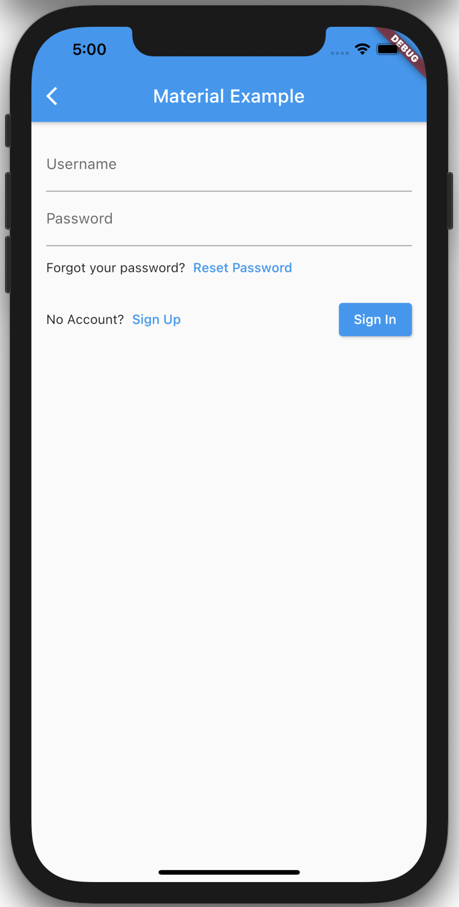
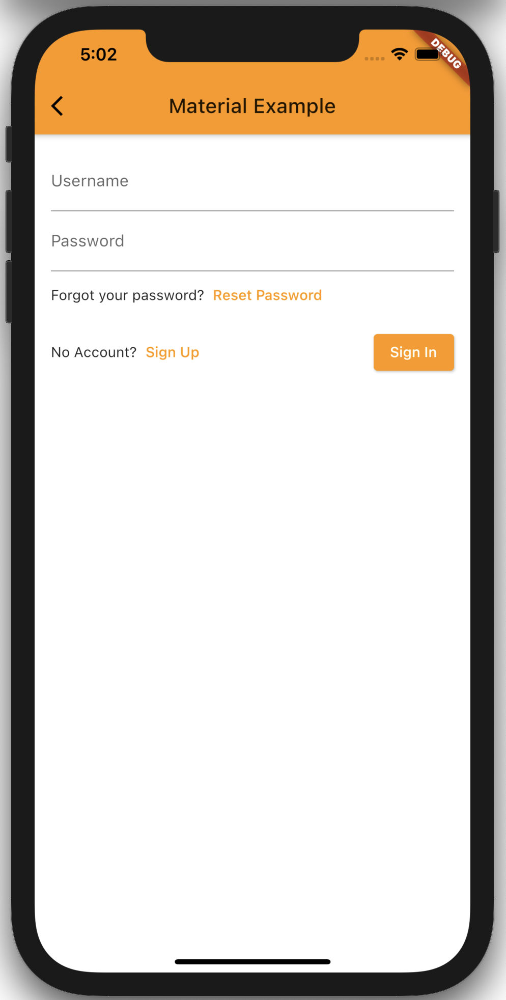
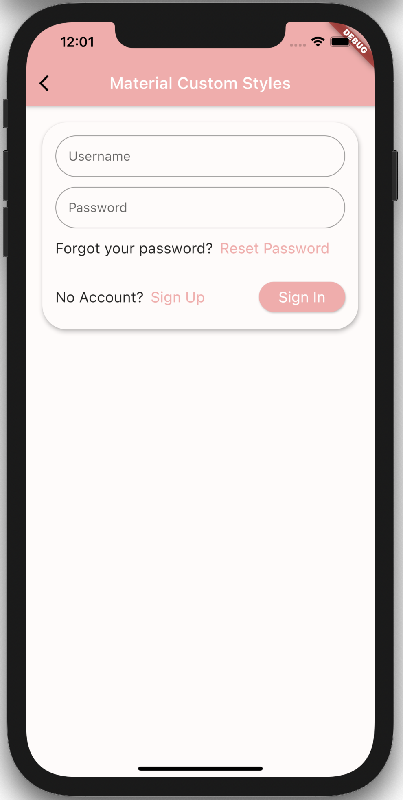

# amplify_authenticator

Flutter Amplify Authenticator UI component

## Set up

- Install and set up [flutter](https://flutter.dev/docs/get-started/install) and complete platform setup for iOS or Android if you have not already done so.
- [Set up your IDE](https://flutter.dev/docs/get-started/editor) for flutter development if you have not already done so.
- Run the _example_ project (`/example/amplify_authenticator/main.dart`) on an iOS simulator or Android Emulator. See info under **Run the App** in the [flutter test drive docs](https://flutter.dev/docs/get-started/test-drive?tab=androidstudio) if you are not familiar with how to do this.

> NOTE: Run the app from [main.dart in the example project](./example/amplify_authenticator_example/lib/main.dart)

## Project overview

The project was created as a standard flutter app (using `flutter create`, not `flutter create --template=package`), but has been updated to be structure closer to a package template.

`/lib` contains all the code for the flutter authenticator. This is the code that would be included in a shippable flutter package. [lib/amplify_authenticator.dart](./lib/amplify_authenticator.dart) contains all the public exports for the package. The public exports are a set of (authenticator) widgets, and some types.

`/example/amplify_authenticator/lib/stories` contains the the customer use cases for an Authenticator widget. Each directory represents one use case. [main.dart](./example/amplify_authenticator_example/lib/main.dart) configures amplify auth and displays a list of buttons that will open the different use cases.

Some of the code from the stories has been copied into the readme to make it easy to view. Long term, it would probably make sense to look into something like [Dashbook](https://github.com/erickzanardo/dashbook), [storybook_flutter](https://github.com/ookami-kb/storybook_flutter), or the tooling that the flutter team uses in their own component docs which takes comments from the code and turns them into live code examples.

## State

State is managed with [provider](https://pub.dev/packages/provider) and [state_machine](https://pub.dev/packages/state_machine).

state_machine is used to create a finite state machine for the state (signInIdle, signInPending, signUpIdle, etc.) of the Authenticator widget. This state machine is intended to be used internally, but not exposed to the consumer.

provider is a popular package to share state between multiple widgets. It is used to share the state machine between the various widgets (form fields, buttons, etc.) that need it. provider is also used to share the state within the form fields (username, email, password) in the various places that it is consumed. The use of provider is not essential to the library, and could be swapped out with something simpler like an InheritedWidget.

Because consumers will need to access the state of the Authenticator in order to build more customized flows there is class AuthenticatorState that is exposed publicly, which is just an abstraction on top of the auth state machine and the state of the various for fields. This is intended to be exposed to consumers, and will allow them to build more complex and customized auth flows without having to rebuild the entire flow from scratch.

## TODO

Other than continuing to support additional customer use cases, below are some things that are not yet supported

- Forgot password flow: Sign up, confirm account, and sign in all work as expected. Forgot password has not been implemented
- Error handling: Gracefully handle error on signin/signup and displaying them to the user. This is partially handled, but needs more work.
- localization
- Animations: The form doesn't have any animations by default. Consumers can use MaterialAuthenticationBuilder to create animations before views, but it might make sense to make this easier.
- Cupertino design: This is not one of the customer use cases, but it would probably be something customers would want. [Cupertino](https://flutter.dev/docs/development/ui/widgets/cupertino) widgets match the design of iOS. There is nothing inherently more difficult about building a Cupertino styled authenticator that a Material authenticator.

## Design & Theming Approach

Flutter provides two libraries of widgets out of the box - [Material](https://flutter.dev/docs/development/ui/widgets/material) and [Cupertino](https://flutter.dev/docs/development/ui/widgets/cupertino). These widget libraries are built on top of a "widgets layer", which is illustrated nicely in [this flutter architecture diagram](https://flutter.dev/docs/resources/architectural-overview#architectural-layers) (can seen below as well).


Both of these widget libraries work on all platforms that flutter supports, and with some exceptions (example: [Switch.adaptive()](https://api.flutter.dev/flutter/material/Switch/Switch.adaptive.html)), they do not adapt to the platform. This means that they will look & function identically on all platforms. Flutter also easily allows developers to build their app according to their own custom design systems ("Expressive and Flexible UI" is one of the core principles of flutter). Customers consuming an Amplify Authenticator widget will expect that out of the box both Material and Cupertino are supported, and that the out of the box widgets can be easily extended / customized to their own design system.

When it comes to custom design systems, there are two general approaches that can be taken. The first approach is to start with one of the two widget catalogs (usually material) and extend it to for the design system being used (see the notes on the material [ThemeData class](https://api.flutter.dev/flutter/material/ThemeData-class.html)). The second approach would be to build an entirely new library of widgets on top of the "widgets layer", similar to the Material or Cupertino libraries. The first approach is generally the approach that is taken because it is **far** less work and still allows developes to achieve their custom design system.

For the custom theme use case, it makes sense to focus on supporting the first approach, but still support the second. To best support the first approach, the Authenticator widget should be built on top of the material widgets and it should inherits and use the app's material ThemeData. Below are two main reasons why this approach should be followed:

1. Building on top of material and using material's ThemeData to style the Authenticator widget will allow the Authenticator to inherit the apps Material theme. This means that customers that are already building their custom design system on top of material with the use of ThemeData will get an Authenticator widget that matches their design system for free.
2. Customers that are building on top of the widgets layer, will still be able to consume an Authenticator widget that is built on top of material and consume it in their non-material app. They will be able to wrap the widget in a `Theme()` widget an provide a custom theme. These customers will just not get their custom theme applied for free. They will have to do some work to use a material ThemeData that closely matches their design system.

## Stories

Each of the code snippets below depends on amplify being configured in the clients application. In this project, that is done in `main.dart`. The configuration could in theory be done inside the Authenticator component, but it seems more straight forward to just require the consumers to configure Amplify outside of the component.

### Material Design basic use case

> A customer using Material design can import and authenticator and it will use the default material styles

See Example: [materialAuthenticatorExample.dart](./lib/stories/material/materialAuthenticatorExample.dart)

```dart
import 'package:amplify_authenticator/stories/viewUserInfo.dart';
import 'package:flutter/material.dart';
import 'package:amplify_authenticator/authenticator/components/materialAuthenticator.dart';

class MaterialAuthenticatorExample extends StatelessWidget {
  @override
  Widget build(BuildContext context) {
    return Scaffold(
      appBar: AppBar(
        title: Text('Material Example'),
      ),
      body: Padding(
        padding: const EdgeInsets.all(16.0),
        child: MaterialAuthenticator(
          onSignInSuccess: () => Navigator.pushReplacement(
            context,
            MaterialPageRoute(
              builder: (context) => ViewUserInfo(),
            ),
          ),
        ),
      ),
    );
  }
}
```



### Material Design w/ custom material theme

> A customer using Material design with a custom material theme can import and authenticator and it will use the appropriate styles

See Example: [materialThemeExample.dart](./lib/stories/materialTheme/materialThemeExample.dart)

```dart
import 'package:amplify_authenticator/stories/viewUserInfo.dart';
import 'package:flutter/material.dart';
import 'package:amplify_authenticator/authenticator/components/materialAuthenticator.dart';

class MaterialThemeExample extends StatelessWidget {
  @override
  Widget build(BuildContext context) {
    // Note: This would typically be passed into the MaterialApp() widget in a real world example
    ThemeData themeData = ThemeData.from(
      colorScheme: ColorScheme(
        brightness: Brightness.light,
        background: Colors.white,
        error: Colors.red,
        onBackground: Colors.blueGrey,
        onError: Colors.white,
        onPrimary: Colors.white,
        onSecondary: Colors.black,
        onSurface: Colors.black,
        primary: Colors.orange,
        primaryVariant: Colors.orange[700],
        secondary: Colors.yellow,
        secondaryVariant: Colors.yellow[700],
        surface: Colors.white,
      ),
    );
    return Theme(
      data: themeData,
      child: Scaffold(
        appBar: AppBar(
          title: Text('Material Example'),
        ),
        body: Padding(
          padding: const EdgeInsets.all(16.0),
          child: MaterialAuthenticator(
            onSignInSuccess: () => Navigator.pushReplacement(
              context,
              MaterialPageRoute(
                builder: (context) => ViewUserInfo(),
              ),
            ),
          ),
        ),
      ),
    );
  }
}
```



### Material Design w/ custom material theme

> A customer using custom design system (built on top of material) can import and authenticator and it will use the appropriate styles

```dart
import 'package:amplify_authenticator/stories/viewUserInfo.dart';
import 'package:flutter/material.dart';
import 'package:amplify_authenticator/authenticator/components/materialAuthenticator.dart';

const _primary = const Color(0xFFFAAAAA);
const _secondary = const Color(0xFF5C83C9);
const _error = const Color(0xFFC5032B);
const _surface = const Color(0xFFFFFBFA);

class MaterialCustomeStylesExample extends StatelessWidget {
  @override
  Widget build(BuildContext context) {
    // This is an example of how the authneticator widget will inherit and use the Material ThemeData
    // Note: these themes could (and probably should) be applied app wide (provided to MaterialApp()),
    // but can also be applied locally like in this example
    ThemeData themeData = ThemeData.from(
      colorScheme: ColorScheme(
        brightness: Brightness.light,
        background: _surface,
        error: _error,
        onBackground: Colors.blueGrey,
        onError: Colors.white,
        onPrimary: Colors.white,
        onSecondary: Colors.white,
        onSurface: Colors.black,
        primary: _primary,
        primaryVariant: _primary,
        secondary: _secondary,
        secondaryVariant: _secondary,
        surface: _surface,
      ),
    ).copyWith(
      textTheme: Theme.of(context).textTheme.copyWith(
            bodyText2: Theme.of(context).textTheme.bodyText2.copyWith(
                  fontSize: 18,
                ),
          ),
      inputDecorationTheme: InputDecorationTheme(
        contentPadding: EdgeInsets.all(16),
        border: OutlineInputBorder(
          borderRadius: const BorderRadius.all(
            Radius.circular(30),
          ),
          gapPadding: 0,
        ),
      ),
      textButtonTheme: TextButtonThemeData(
        style: TextButton.styleFrom(
          textStyle: TextStyle(
            fontSize: 18,
          ),
        ),
      ),
      elevatedButtonTheme: ElevatedButtonThemeData(
        style: ElevatedButton.styleFrom(
          shape: RoundedRectangleBorder(
            borderRadius: BorderRadius.circular(30),
          ),
          padding: EdgeInsets.symmetric(
            horizontal: 24,
            vertical: 8,
          ),
          textStyle: TextStyle(
            fontSize: 18,
          ),
        ),
      ),
    );
    return Theme(
      data: themeData,
      child: Scaffold(
        appBar: AppBar(
          title: Text(
            'Material Custom Styles',
            style: TextStyle(color: Colors.white),
          ),
        ),
        body: Padding(
          padding: const EdgeInsets.all(16.0),
          child: Column(
            children: [
              Card(
                shape: RoundedRectangleBorder(
                  borderRadius: BorderRadius.circular(30),
                ),
                elevation: 4,
                child: Padding(
                  padding: const EdgeInsets.all(16),
                  child: MaterialAuthenticator(
                    onSignInSuccess: () => Navigator.pushReplacement(
                      context,
                      MaterialPageRoute(
                        builder: (context) => ViewUserInfo(),
                      ),
                    ),
                  ),
                ),
              ),
            ],
          ),
        ),
      ),
    );
  }
}
```



### Use outside of MaterialApp or CupertinoApp

> A customer that is not using the Material or Cupertino design systems as a base can still consume the Authenticator widget.

> Material Authenticator can be consumed inside a non material app

TODO

### Cupertino Design basic use case

> A customer using Cupertino design can import and authenticator and it will use the default cupertino styles

TODO
